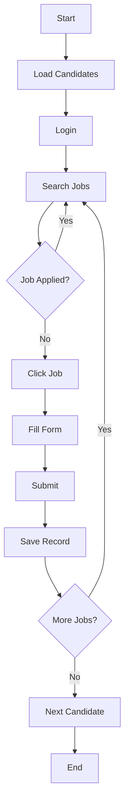

#  Insight Global Job Application Bot

**Automated job application bot for jobs.insightglobal.com**

[](https://www.python.org/downloads/)
[](https://www.selenium.dev/)
[](LICENSE)

---

##  Overview

Automate your job search on Insight Global! This bot logs in, searches for jobs, fills application forms, and tracks everything for you.

###  Key Features

-  **Multi-Candidate Support** - Apply for multiple people
-  **Custom Locations** - Each candidate specifies preferred location  
-  **No Duplicates** - Tracks applied jobs automatically
-  **Auto Form Fill** - LinkedIn URL, phone, requirements
-  **Detailed Tracking** - CSV logs of all applications
-  **Smart Recovery** - Handles errors gracefully
-  **Fast & Reliable** - Applies to 50+ jobs per candidate

---

##  Quick Start

### 1. Install
```bash
pip install -r requirements.txt
```

### 2. Configure
Edit `data/candidates.csv`:
```csv
Email,Password,FirstName,LastName,Phone,ResumePath,PreferredLocation,LinkedInUrl,Status
your@email.com,Pass123,John,Doe,5551234567,resumes/resume.pdf,Los Angeles,https://linkedin.com/in/john,Active
```

### 3. Run
```bash
python src/jobbot_multi.py
```

That's it! 

---

##  Project Structure

```
jobbot_project/
├── src/
│   └── jobbot_multi.py       
├──  data/
│   ├── candidates.csv          
│   └── applied_jobs.csv         
├──  config/
│   └── settings.ini             
├──  logs/                    
└──  resumes/                  
```

---

##  Configuration

### Candidates (`data/candidates.csv`)

| Column | Description | Example |
|--------|-------------|----------|
| Email | Login email | `john@email.com` |
| Password | Login password | `SecurePass123` |
| Phone | Phone number | `5551234567` |
| PreferredLocation | Job location | `Los Angeles` or `Remote` |
| LinkedInUrl | LinkedIn profile | `https://linkedin.com/in/john` |
| Status | Active/Inactive | `Active` |

### Settings (`config/settings.ini`)

```ini
[search]
keywords = Software Engineer, Python Developer
max_applications_per_candidate = 50

[bot]
headless = False
```

---

##  How It Works



1. **Login** - Logs in with candidate credentials
2. **Search** - Searches using keywords + preferred location
3. **Apply** - Clicks job, fills form, submits
4. **Track** - Saves to `applied_jobs.csv`
5. **Repeat** - Continues until max applications reached
6. **Next** - Moves to next candidate

---

##  Statistics

View your applications:
```bash
type data\applied_jobs.csv
```

Example output:
```csv
CandidateEmail,JobTitle,JobID,AppliedDate,Status
john@email.com,Software Engineer,440081,2025-11-19 11:30:00,Applied
john@email.com,Python Developer,440082,2025-11-19 11:31:00,Applied
```

---

##  Important Notes

-  **Upload Resume First** - Upload resume to your Insight Global account before running
-  **Protect Credentials** - Don't commit `candidates.csv` to Git
-  **Be Patient** - Bot includes delays to avoid detection
-  **Monitor Applications** - Check email for responses
-  **Quality Over Quantity** - Only apply to relevant jobs

---

##  Best Practices

1. **Test First** - Run with 1 Active candidate
2. **Check Logs** - Monitor `logs/` for any issues
3. **Start Small** - Set `max_applications = 10` initially
4. **Review Jobs** - Verify applied_jobs.csv regularly
5. **Keep Resume Updated** - Update on website when needed


